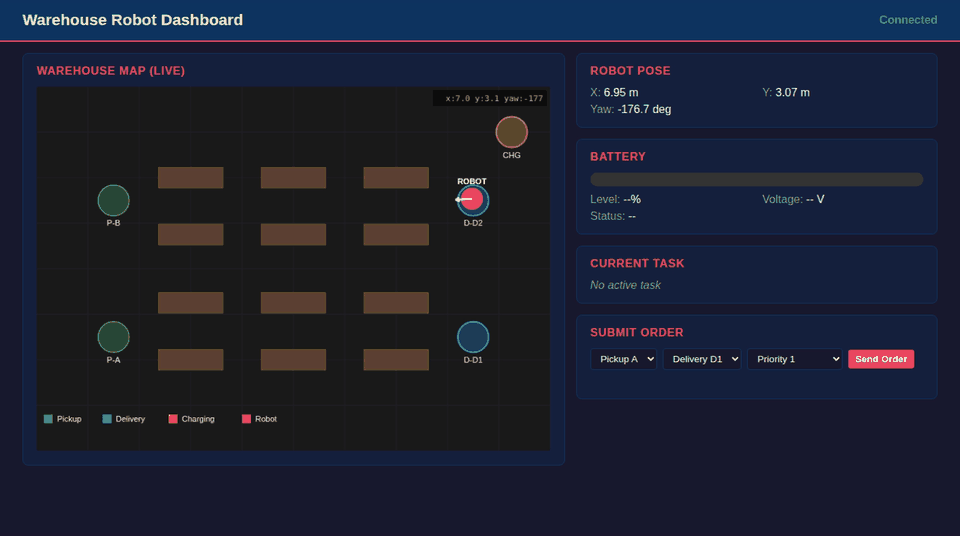

# ROS2 Warehouse Delivery Robot

A full-stack ROS2 mobile robot system for autonomous warehouse deliveries. The robot SLAM-maps a custom Gazebo warehouse, navigates via Nav2 with behavior trees, executes prioritized delivery tasks, and reports real-time status through a monitoring dashboard.



---

## Features

- **Differential-drive robot** with lidar, IMU, and camera in URDF/xacro
- **Custom Gazebo warehouse** with shelving aisles, pickup/delivery stations, and animated human obstacles
- **SLAM mapping** via slam_toolbox for autonomous map building
- **Nav2 navigation** with SmacPlannerHybrid, DWB controller, and custom behavior trees
- **Task orchestration** with priority queue, state machine, and battery-aware scheduling
- **Monitoring dashboard** (terminal TUI via Rich + web dashboard via roslibjs)
- **Fault recording** with automatic rosbag2 capture on diagnostic errors

---

## Architecture

```
                    SubmitOrder / CancelOrder
  Dashboard / CLI ────────────────────────────> TaskManagerNode
       ^                                            |
       |  /current_task                             | Nav2 NavigateToPose
       |  /task_queue                               | Action Client
       |  /battery_state                            v
       |  /diagnostics                        Nav2 Stack
       |                                      (Planner + Controller + BT)
       |                                            |
       +-------- TF2, Topics ------ Robot <---------+
                                    (Gazebo Simulation)
```

### Packages

| Package | Description |
|---------|-------------|
| `warehouse_interfaces` | Custom msg/srv/action definitions |
| `warehouse_robot_description` | URDF/xacro robot model with sensors and ros2_control |
| `warehouse_gazebo` | Custom warehouse world, Gazebo models, spawn launch |
| `warehouse_slam` | slam_toolbox configuration and mapping launch |
| `warehouse_navigation` | Nav2 parameters, behavior trees, waypoints |
| `warehouse_task_manager` | Delivery task orchestrator with battery management |
| `warehouse_dashboard` | Terminal TUI + web dashboard + fault recorder |
| `warehouse_bringup` | Top-level composed launch files |

### Topic/Service/Action Graph

```
Topics:
  /scan              LaserScan       Lidar -> Nav2, SLAM
  /odom              Odometry        diff_drive_controller -> Nav2
  /cmd_vel           Twist           Nav2 -> diff_drive_controller
  /map               OccupancyGrid   map_server -> Nav2, Dashboard
  /battery_state     BatteryState    battery_sim -> task_manager, Dashboard
  /current_task      DeliveryOrder   task_manager -> Dashboard
  /task_queue        TaskQueue       task_manager -> Dashboard
  /diagnostics       DiagnosticArray All nodes -> Dashboard, Fault Recorder

Services:
  /submit_order      SubmitOrder     CLI/Dashboard -> task_manager
  /cancel_order      CancelOrder     CLI/Dashboard -> task_manager

Actions:
  /navigate_to_pose  NavigateToPose  Nav2 (server) <- task_manager
```

---

## Prerequisites

- **ROS2 Humble** (Ubuntu 22.04) or **Docker**
- Gazebo Classic 11
- Nav2, slam_toolbox, ros2_control (installed via rosdep)
- Python packages: `rich`

---

## Quick Start

### Option A: Native Build

```bash
# Clone
git clone https://github.com/ycchow/warehouse-delivery-robot.git
cd warehouse-delivery-robot

# Install dependencies
rosdep install --from-paths src --ignore-src -r -y
pip3 install rich

# Build
colcon build --symlink-install
source install/setup.bash
```

### Option B: Docker

```bash
cd .docker
docker compose up --build
docker exec -it <container_id> bash
```

---

## Usage

### 1. Simulation Only

Launch the robot in the warehouse with teleop control:

```bash
ros2 launch warehouse_bringup sim.launch.py
```

In another terminal, drive with teleop:

```bash
ros2 run teleop_twist_keyboard teleop_twist_keyboard --ros-args -r cmd_vel:=/diff_drive_controller/cmd_vel_unstamped
```

### 2. SLAM Mapping

Build a map of the warehouse by driving through all aisles:

```bash
ros2 launch warehouse_bringup slam.launch.py
```

Drive the robot through the warehouse, then save the map:

```bash
ros2 run nav2_map_server map_saver_cli -f src/warehouse_navigation/maps/warehouse_map
```

### 3. Autonomous Navigation

Navigate using the saved map:

```bash
ros2 launch warehouse_bringup navigation.launch.py
```

Send goals via rviz2 (2D Goal Pose) or command line:

```bash
ros2 action send_goal /navigate_to_pose nav2_msgs/action/NavigateToPose \
  "{pose: {header: {frame_id: 'map'}, pose: {position: {x: 7.0, y: -3.0}}}}"
```

### 4. Full System (Navigation + Task Manager + Dashboard)

```bash
ros2 launch warehouse_bringup full_system.launch.py
```

Submit delivery orders:

```bash
# High-priority delivery from pickup A to delivery D1
ros2 service call /submit_order warehouse_interfaces/srv/SubmitOrder \
  "{pickup_station: 'A', delivery_station: 'D1', priority: 1}"

# Lower-priority delivery
ros2 service call /submit_order warehouse_interfaces/srv/SubmitOrder \
  "{pickup_station: 'B', delivery_station: 'D2', priority: 3}"

# Cancel an order
ros2 service call /cancel_order warehouse_interfaces/srv/CancelOrder \
  "{order_id: '<order_id>'}"
```

### 5. Demo Mode (Auto-submits orders)

```bash
ros2 launch warehouse_bringup demo.launch.py
```

### 6. Web Dashboard

```bash
ros2 launch warehouse_dashboard web_dashboard.launch.py
```

Open `http://localhost:8080` in your browser.

---

## Configuration

### Adding/Modifying Stations

Edit `src/warehouse_navigation/config/waypoints.yaml`:

```yaml
waypoints:
  pickup_A:
    x: -7.0
    y: -3.0
    yaw: 0.0
  # Add new stations here
```

Also update `src/warehouse_task_manager/config/stations.yaml` and `stations.py` aliases.

### Tuning Navigation

Edit `src/warehouse_navigation/config/nav2_params.yaml`:

- **Planner**: SmacPlannerHybrid — adjust `minimum_turning_radius`, `tolerance`
- **Controller**: DWB — adjust `max_vel_x`, `max_vel_theta`, critic weights
- **Costmap**: Adjust `inflation_radius` for tight aisles

### Battery Settings

The battery simulator drains at 0.5%/min while moving and charges at 5%/min at the charging station. The task manager interrupts at 20% battery. Adjust in `task_manager_node.py`.

---

## Testing

```bash
# Unit tests
colcon test --packages-select warehouse_task_manager
colcon test-result --verbose

# Run all tests
colcon test
colcon test-result --verbose
```

---

## Warehouse Layout

```
 ___________________________________________________________
|                                                           |
|  [Pickup A]                              [Delivery D1]    |
|     (green)     Shelf  Shelf  Shelf        (blue)         |
|                                                           |
|                 Shelf  Shelf  Shelf                        |
|                          <-- Human 2 -->                   |
|  <--- Human 1 --->                                        |
|                 Shelf  Shelf  Shelf                        |
|                                                           |
|  [Pickup B]     Shelf  Shelf  Shelf      [Delivery D2]    |
|     (green)                                (blue)         |
|                                          [Charger]        |
|_____   _____   ___________   _____   _____(yellow)________|
      |_|     |_|           |_|     |_|
       Dock Doors (South Wall)
```

Robot spawns at the south end facing north.

---

## Project Structure

```
.
├── .docker/                    # Docker development environment
├── .github/workflows/ci.yaml  # GitHub Actions CI
├── docs/                       # Architecture diagram, demo GIF
├── README.md
└── src/
    ├── warehouse_interfaces/         # Custom msg/srv/action
    ├── warehouse_robot_description/  # URDF/xacro + sensors + ros2_control
    ├── warehouse_gazebo/             # Gazebo world + models
    ├── warehouse_slam/               # slam_toolbox config
    ├── warehouse_navigation/         # Nav2 + behavior trees
    ├── warehouse_task_manager/       # Task orchestration + battery sim
    ├── warehouse_dashboard/          # TUI + web dashboard
    └── warehouse_bringup/            # Top-level launch files
```

---

## Technologies

- **ROS2 Humble** | **Gazebo Classic 11** | **Nav2** | **slam_toolbox**
- **ros2_control** (diff_drive_controller) | **tf2** | **rosbag2**
- **Python 3** | **Rich** (TUI) | **roslibjs** (web dashboard)
- **Docker** | **GitHub Actions CI**

---

## License

MIT

---

## Troubleshooting (Docker)

If `docker compose up --build` fails with:

```text
permission denied while trying to connect to the Docker daemon socket
```

run Compose with sudo:

```bash
cd .docker
sudo docker compose up --build -d
```

If Gazebo fails with:

```text
Unable to start server[bind: Address already in use]
```

it usually means a stale `gzserver` process is still running in the container. Restart the container and relaunch:

```bash
sudo docker restart docker-ros2-1
sudo docker exec -it docker-ros2-1 bash
source /opt/ros/humble/setup.bash
source /ros2_ws/install/setup.bash
ros2 launch warehouse_bringup full_system.launch.py
```

---

## One-Command Run (Recommended)

From the project root:

```bash
chmod +x run_project.sh
./run_project.sh
```

What this script does:

- Builds/starts Docker
- Launches full system + web dashboard inside container
- Exposes dashboard at `http://localhost:8080`
- Exposes noVNC at `http://localhost:6080`
- Opens the dashboard automatically on Linux desktops

Useful while running:

```bash
# Follow full system log
sudo docker exec docker-ros2-1 tail -f /tmp/full_system_live.log

# Follow web dashboard log
sudo docker exec docker-ros2-1 tail -f /tmp/web_dashboard_live.log
```

If you click **Send Order** and want to confirm execution:

- `/current_task` should move from `navigating_to_pickup` to `navigating_to_delivery`, then back to `idle`.
- Robot should move from spawn (`y=-6`) toward pickup/delivery stations.

### Record Demo Video

From project root:

```bash
python3 -m venv .venv-demo
.venv-demo/bin/pip install imageio imageio-ffmpeg pillow
.venv-demo/bin/python scripts/record_demo_video.py --output docs/demo/dashboard-demo.mp4
```

This captures the live dashboard and submits one sample order during recording.

---

## Virtual Pick/Place Scaffold

The system now includes simulated manipulation actions:

- `/pick_object` (`warehouse_interfaces/action/PickObject`)
- `/place_object` (`warehouse_interfaces/action/PlaceObject`)

Flow per order is now:

1. Navigate to pickup station
2. Execute `PickObject` action
3. Navigate to delivery station
4. Execute `PlaceObject` action
5. Mark order completed

To verify from logs:

```bash
sudo docker exec docker-ros2-1 grep -E "Sending pick action|Picked|Sending place action|Placed|completed!" /tmp/full_system_live.log | tail -n 50
```

---

## Latest Runtime Notes (2026-04-09)

- `run_project.sh` now force-cleans stale ROS/Gazebo processes before relaunch, so `gzserver` no longer fails with `Address already in use`.
- Task dispatch now waits for Nav2 action readiness plus TF chain availability (`odom/base_link`, `map/odom`, `map/base_link`) before sending goals.

If web log still shows:

```text
Unable to import tf2_web_republisher.msg
```

this is usually from an old browser tab still running cached JS that used `TFClient`. Open a fresh tab at:

```text
http://localhost:8080/
```

and hard-refresh (`Ctrl+Shift+R`).
